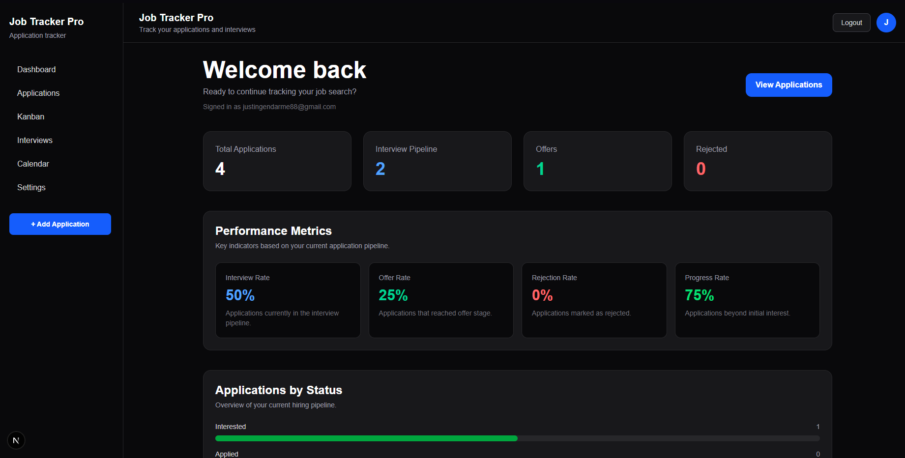
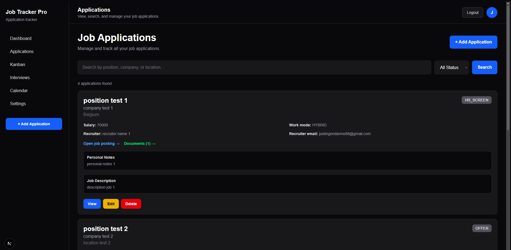
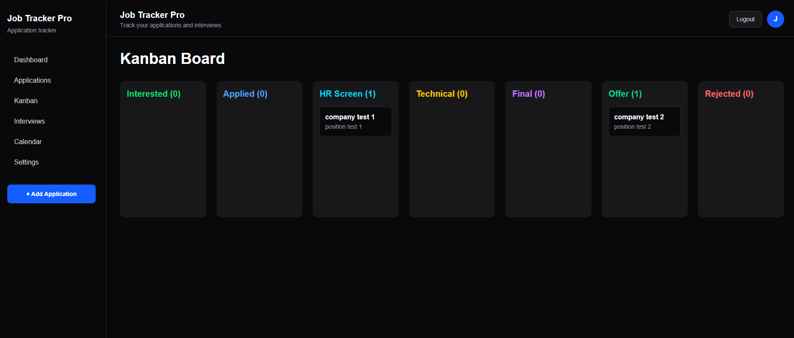
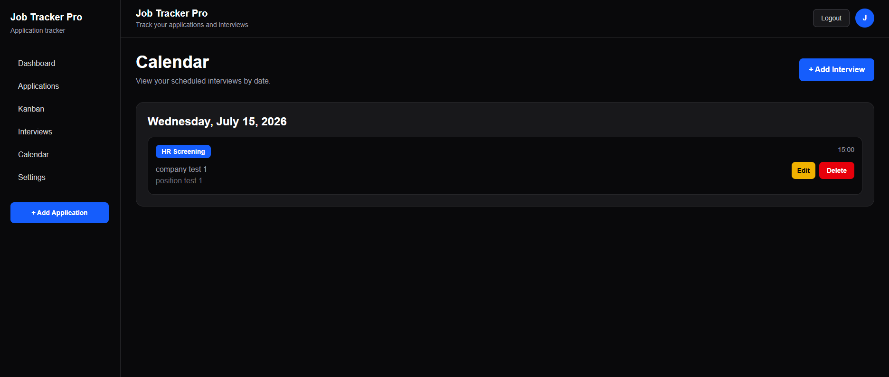
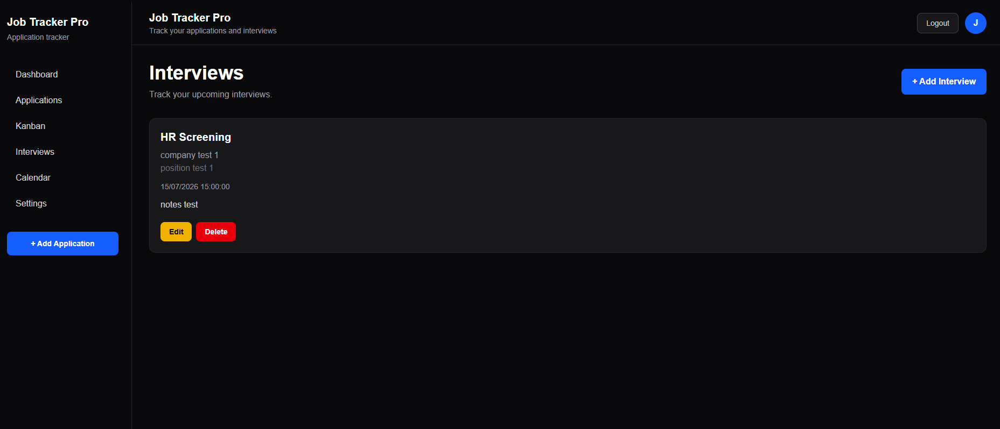
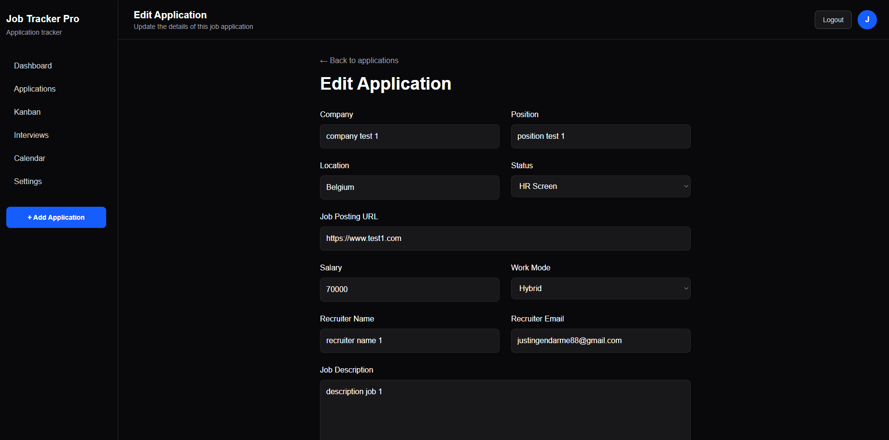
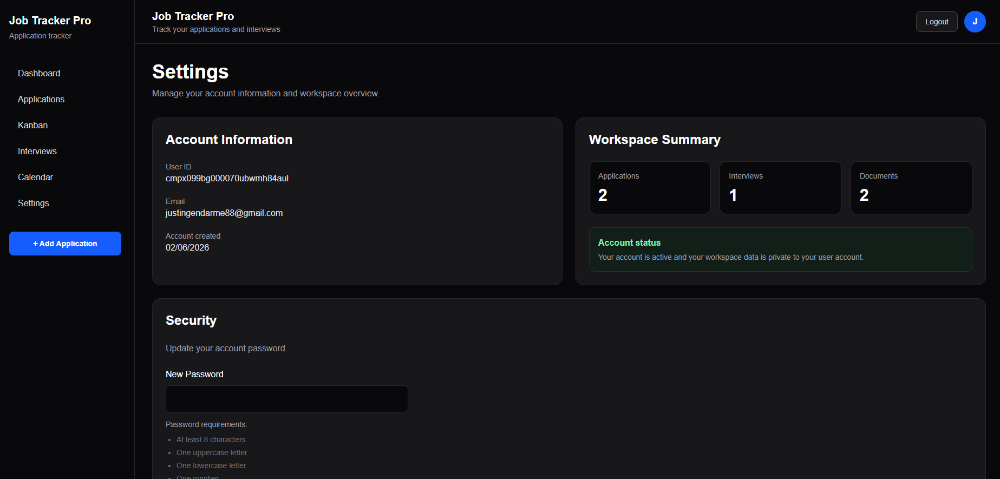

# Job Tracker Pro

A modern full-stack SaaS application for tracking job applications, interviews, recruitment progress and documents.

Built with **Next.js**, **TypeScript**, **Prisma** and **Supabase**.

## 🌐 Live Demo

**Application:** https://job-tracker-pro-one.vercel.app

**Demo account:** Available upon request for recruiters.


---


## Screenshots

### Dashboard



### Applications



### Kanban Board



### Calendar



### Interviews



### Application Details



### Settings



---

# Features

### Authentication

* Secure user authentication
* Sign up / Login / Logout
* Password recovery by email
* Password change
* Protected routes

### Job Applications

* Create, edit and delete applications
* Search applications
* Filter by recruitment status
* Store recruiter information
* Track salary and work mode
* Personal notes
* Job description
* Job posting links

### Recruitment Pipeline

Track every stage of the recruitment process:

* Interested
* Applied
* HR Screen
* Technical Interview
* Final Interview
* Offer
* Rejected

### Interview Management

* Schedule interviews
* Calendar view
* Interview notes
* Edit/Delete interviews

### Kanban Board

Visual recruitment pipeline with drag & drop between stages.

### Documents

Upload and manage:

* Resume
* Cover Letter
* Job Offer PDF
* Portfolio
* Other documents

Files are securely stored in Supabase Storage.

### Dashboard

Overview including:

* Total applications
* Interview statistics
* Offers
* Rejection rate
* Progress metrics
* Recent applications
* Upcoming interviews

### User Settings

* Account information
* Workspace statistics
* Password management

---

# 🛠 Tech Stack

## Frontend

* Next.js 16
* React
* TypeScript
* Tailwind CSS

## Backend

* Next.js Server Actions
* Prisma ORM

## Database

* PostgreSQL
* Supabase Database

## Storage

* Supabase Storage

## Authentication

* Supabase Auth

---

# Installation

Clone the repository

```bash
git clone https://github.com/JustinGendarme88/JobTrackerPro.git
```

Install dependencies

```bash
npm install
```

Create a `.env` file and configure your Supabase credentials.

Run the development server

```bash
npm run dev
```

Open:

```
http://localhost:3000
```

---

# Project Structure

```
src/
 ├── app/
 │    ├── dashboard/
 │    ├── applications/
 │    ├── interviews/
 │    ├── calendar/
 │    ├── kanban/
 │    ├── settings/
 │    ├── login/
 │    ├── signup/
 │    └── forgot-password/
 │
 ├── components/
 ├── lib/
 └── prisma/
```

---

# Future Improvements

* Email notifications
* Advanced dashboard charts
* Tags & labels
* CSV export
* Mobile responsive improvements
* Multi-language support

---

# Author

Justin Gendarme

- GitHub: https://github.com/JustinGendarme88
- LinkedIn: https://www.linkedin.com/in/justin-gendarme-2aba2b368

---

## License

MIT
